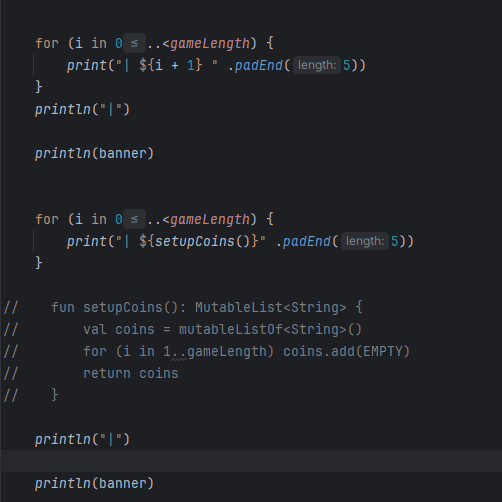

# Results of Testing

The test results show the actual outcome of the testing, following the [Test Plan](test-plan.md)

---

## Example Test Name

Do the player names get stored correctly for later use

### Test Data Used

Run the program and see if it'll display player names

### Test Result

The program ran without any errors and collected and displayed player names correctly 

---

## Example Test Name

Display the coins on the board 

### Test Data Used

Run the program. The program will display the list in every individual box instead of put the list into the board 
like you would expect. 

### Test Result

I need to fix this and will show the fix later. 

---

