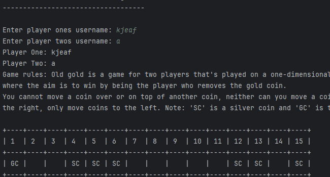
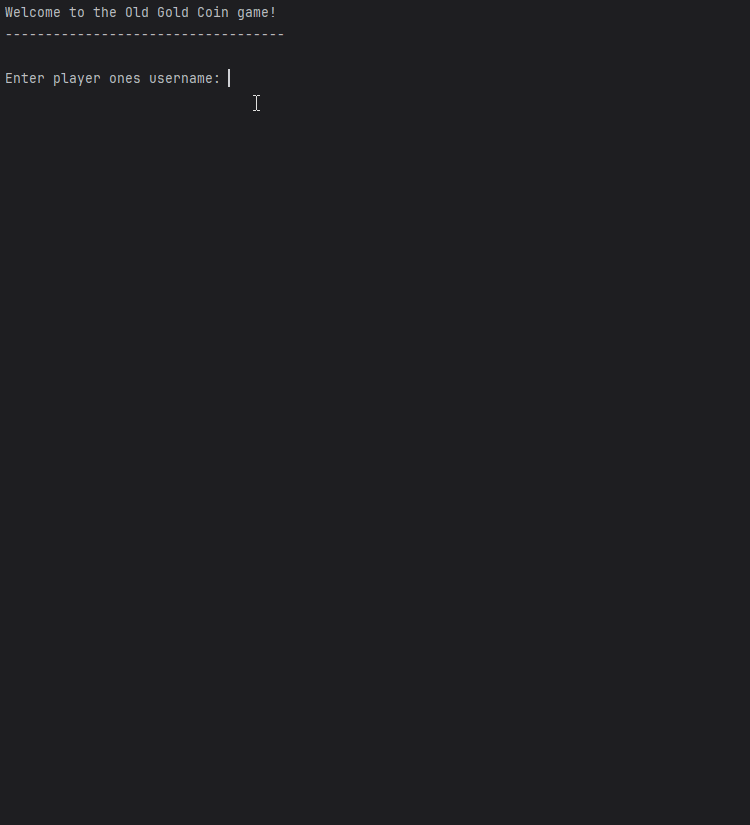

# Results of Testing

The test results show the actual outcome of the testing, following the [Test Plan](test-plan.md)

---

## Player names 

Do the player names get stored correctly for later use

### Test Data Used

Run the program and see if it'll display player names

### Test Result

The program ran without any errors and collected and displayed player names correctly 

---

## Moving and removing coins

Do the coins move and remove from the grid. 

### Test Data Used

Run the program and see if the game responds to my input 

### Test Result
Game works and does what its meant to. 

---

## Boundary testing 

Do the coins get randomly placed on the boundaries (slot 1 and slot 15)

### Test Data Used

Run the program and see if the coins place on the boundary slots 

### Test Result
Coins can be displayed on the boundaries 

## Winning the game 

When the Gold Coin (GC) is removed is game won. 

### Test Data Used

Remove the gold coin from the grid 

### Test Result
Game was won after the GC was removed 

## Example 

When the Gold Coin (GC) is removed is game won.

### Test Data Used

Remove the gold coin from the grid

### Test Result
Game was won after the GC was removed

